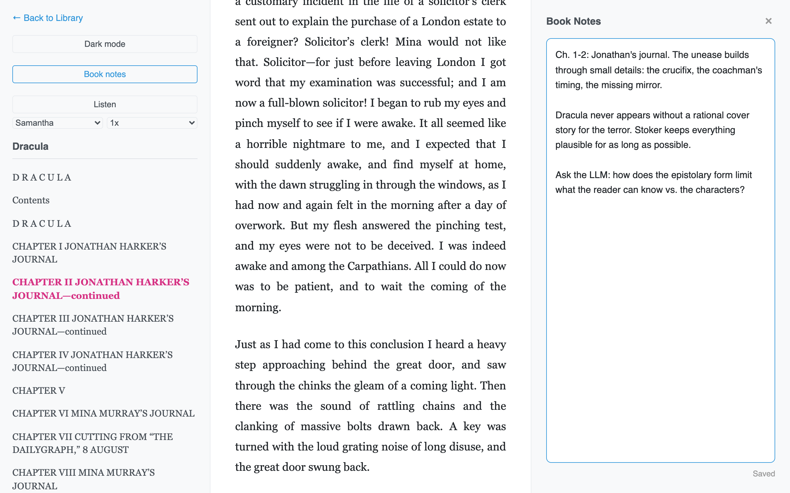
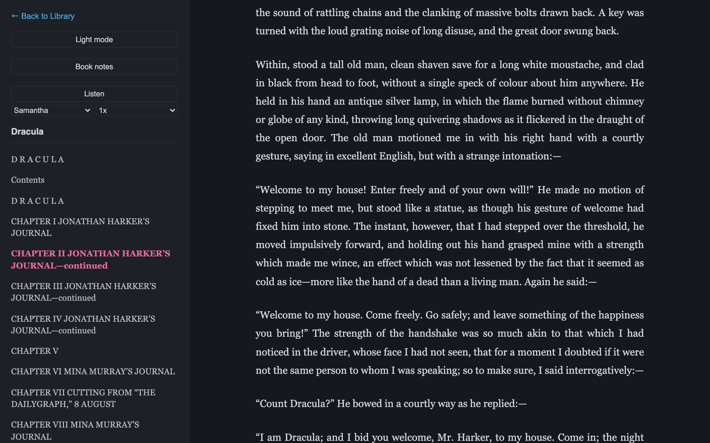
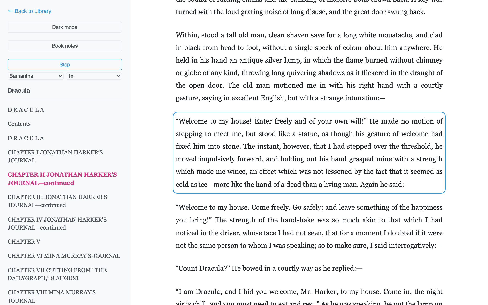

# reader3

A fork of [karpathy/reader3](https://github.com/karpathy/reader3), customized for some use cases I specifically wanted

Everything stays local. No accounts, no cloud, no network calls once the server is up.

## What's added

**Book notes.** A side panel per book that autosaves as you type. Notes live in a plain `notes.txt` inside the book's data folder, so they're easy to grep, back up, or paste into an LLM.



**Dark mode.** Follows the system preference by default, with a toggle that persists.



**Listen.** Text to speech using the voices already on the machine, through the browser's Web Speech API. The current paragraph is highlighted and kept centered as it's read, so you can follow along or just let it run. Pick any installed voice and a speed; both are remembered.



On macOS the better voices are a download away: System Settings, Accessibility, Spoken Content, System Voice, Manage Voices. Enhanced and Premium voices show up in the picker on reload.

## Usage

Requires [uv](https://docs.astral.sh/uv/). Drop an EPUB in the directory (e.g. [Dracula](https://www.gutenberg.org/ebooks/345) from Project Gutenberg), then:

```bash
uv run reader3.py dracula.epub   # creates dracula_data/, registers the book
uv run server.py                 # http://localhost:8123
```

Delete a book's `_data` folder to remove it from the library.

## License

MIT
